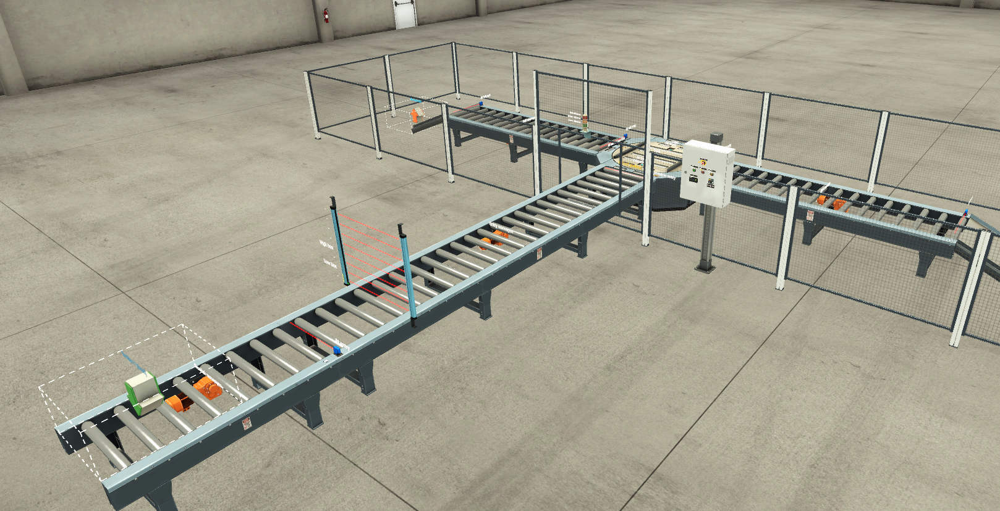

# Step-7-projects-in-Awl-and-Fbd
Plc programs developed in Siemens Step 7 and WinCC Flexible in Awl (Instruction list) and Fbd(Function block diagram).
## Sorting by Height Advanced process with Shift instruction.
This project consist of **sorting boxes by their height** in order to send them to a specific location of the process/plant. This control is made by a **sensor** located between the main conveyor belts (**feeder** and **entry**).
Once the sensor detects a large box, a bit from a memory word varible (MW) is set on a negative edge detection. At the same time, the sensor that detectes if a box is passing by or not, is in charge to 
**shift** the activated bit, in order to "**follow the large box**" previously detected. 

When any box arrives at the **turn table station**, in that moment, the **shifted bit** is consulted to decide where to send that box to. If the box is a large box, it will be sent to the left conveyor. Otherwise, it will go through the oppsites conveyor.

## Project execution and main considerations

